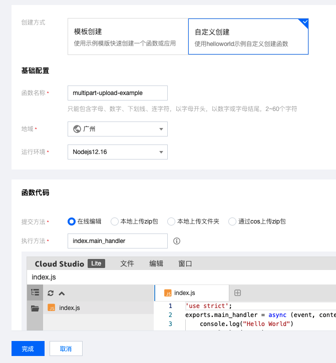
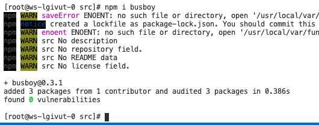
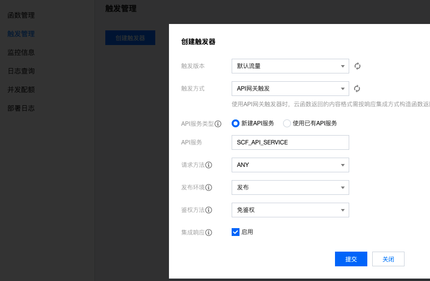
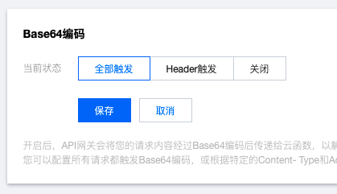

# Tencent Serverless 处理 multipart 多文件上传 example

[最终效果](https://service-55o5m2vg-1256777886.gz.apigw.tencentcs.com/release/multipart-upload-example)

通过腾讯云 Serverless 处理 multipart 多文件上传的 HTTP 请求，原理上需要利用 API 网关的 base64 编码能力，将字节流编码为字符串，以便将 HTTP Event 传入 SCF 云函数进行处理。

云函数将 API 网关传来 event 中的 body 获取并解码 base64 后，生成的字节流则与普通 HTTP 请求中的无异，正常处理即可。在 Node.JS 中，我们可以利用 `busboy` 等库进行处理。

## 详细教程

### 创建云函数

首先，我们需要创建一个 `Node.js` 云函数，可以访问[该页面](https://console.cloud.tencent.com/scf/list-create?rid=1&ns=default&functionName=multipart-upload-example&createType=empty)创建。

创建时，具体参数如下：



点击完成，完成云函数的创建。


### 编写代码并部署

云函数创建完成后，我们还没有编写处理 formdata 的具体逻辑。我们将以下代码粘贴到 CloudStudio 中（当然，您也可以编写自己的逻辑，进行具体的处理）

```js
// handler.js
"use strict";
const stream = require("stream");
const Busboy = require("busboy");

/** 处理用户上传 （POST） */
const handlePost = (event) => {
  return new Promise((resolve, reject) => {
    const busboy = new Busboy({ headers: event.headers });
    let html = "";
    /** 接受到文件 */
    busboy.on("file", (fieldname, file, filename, encoding, mimetype) => {
      let buf = Buffer.alloc(0);
      console.log({ fieldname });
      /** 接受到文件的数据块，拼接出完整的 buffer */
      file.on("data", function (data) {
        buf = Buffer.concat([buf, data]);
      });
      /** 文件的数据块接受完毕，生成 DOM 字符串 */
      file.on("end", function () {
        const imgBase64 = buf.toString("base64");
        html += ``;
      });
    });
    /** multipart formdata 接受完毕，构造并返回生成的 html */
    busboy.on("finish", function () {
      console.log({ msg: "Parse form complete!", html });
      resolve({
        statusCode: 200,
        headers: {
          "content-type": "text/html",
        },
        body: html,
      });
    });

    /**
     * busboy 需要 stream pipe 的方式来进行处理，
     * 我们将 body 解码为 buffer后，
     * 转换为 stream，最终 pipe 给 busbody
     */
    const bodyBuf = Buffer.from(event.body, "base64");
    var bufferStream = new stream.PassThrough();
    bufferStream.end(bodyBuf);
    bufferStream.pipe(busboy);
  });
};

/** 返回静态文件 */
const handleGet = (event) => {
  const html = `<html><head></head><body>
    <form method="POST" enctype="multipart/form-data">
    <input type="file" name="image-1" accept="image/*"><br />
     <input type="file" name="image-2" accept="image/*"><br />
     <input type="submit">
    </form>
    </body></html>`;
  console.log({ msg: "Get form complete!", html });
  return {
    statusCode: 200,
    headers: {
      "content-type": "text/html",
    },
    body: html,
  };
};

/** 云函数入口函数 */
exports.main_handler = async (event, context) => {
  const method = event.httpMethod;
  /** 当请求为 POST 请求时，我们处理用户的 multipart formdata，并生成展示上传结果的页面 */
  if (method === "POST") {
    return handlePost(event);
  }
  /** 当请求为 GET 请求时，我们返回上传文件的页面 */
  if (method === "GET") {
    return handleGet(event);
  }
};
```

编写代码后，您也可以为云函数安装运行时需要的依赖，例如，我们这里利用 busboy 帮助我们进行 multipart 数据的解码。(注意：依赖要安装在 src 文件夹下)



最终，我们点击部署，完成云函数的部署。

### 绑定 API 网关触发器

在云函数的触发管理中，我们需要为云函数绑定 API 网关触发器，才能够处理用户具体的 HTTP 请求，具体的，绑定方式和配置如下图：



这个时候，如果我们访问 API 网关绑定的链接，我们会发现虽然静态页面能够工作，但是上传图片后，页面没有展示正确的结果。这是因为默认情况下，API 网关没有开启 base64 编码功能，我们的 multipart formdata 被错误编码为字符串传入 handler 函数，busboy 自然无法进行解码。


因此，我们需要进入 API 网关，找到我们绑定的 API 服务，在其中的基础配置中打开 base64 编码。



打开并发布服务后，我们的服务就可以正确工作了。

[最终效果](https://service-55o5m2vg-1256777886.gz.apigw.tencentcs.com/release/multipart-upload-example)